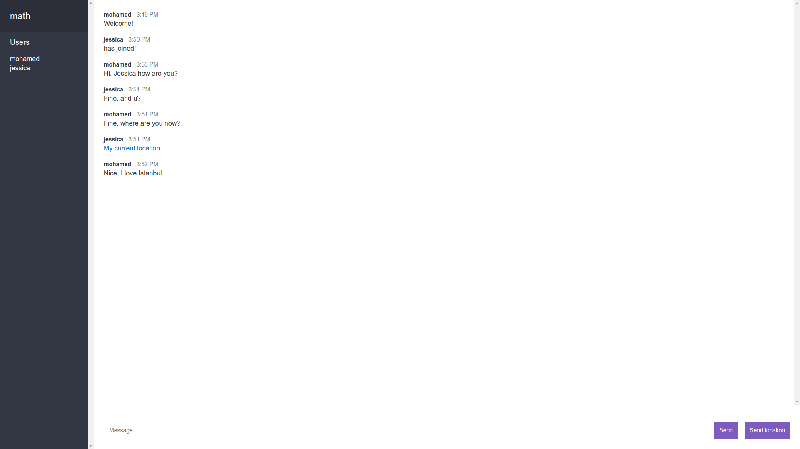

# Getting Started with Chat App

## Available Live Demo

Click [Here](https://chat-app-ghandour.herokuapp.com/) to View the Production.
Server

### login

[](https://chat-app-ghandour.herokuapp.com/)

### form chat

[](https://chat-app-ghandour.herokuapp.com/)

## Setup

Get the code:

```
git clone https://github.com/MohamedElGhandour/chat-app-learning-nodejs.git
```

Install dependencies:

```
cd chat-app-learning-nodejs
npm install
```

Run the server:

```
npm start
```

Run the server (dev mode):

```
npm run dev
```

Point a web browser at the demo:

```
http://localhost:4000
```
